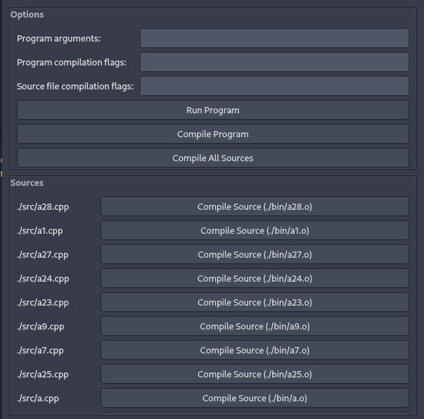

# qtclang

Small PyQt GUI for C/C++ applications

## Requirements

* Python >=3.4
* PyQt5

## Setup

Linux

* `sudo ln -s /path/to/qtclang.py /usr/local/bin/qtclang`
* `chmod +x /usr/local/bin/qtclang`
* `qtclang`

## What it looks like

## TODO

* wip
* create bin folder if it doesnt exist when compiling (i accidentally removed this)
* be able to change more options from within the program
* add a way to toggle certain flags like SFML and -g, -O3, etc.
* change menu to be tabbed
* improve file io for the `.qtclang` file
* explain comamnd line arguments
* Add option to load up with flags and add config file option (that will be used if present)
* Add search bar for source files
