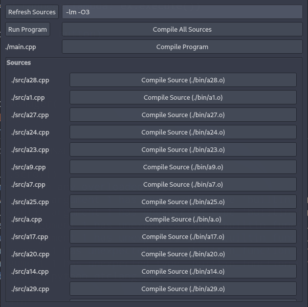

# qtclang

Small PyQt GUI for C/C++ applications

When loaded up, you are presented with all the C/C++ source files in a given directory. These can be compiled.
There is also the option to compile the program file (containing the main function) and to run this file. Source files can be refreshed if they are added/removed while the program is open. The source,output, and program directories cannot be changed while qtclang is running yet.

## Instructions

* Put `qtclang.py` inside of C or C++ directory
* Check the `main()` function for the configuration settings
  * Change compiler
  * Change object file extension
  * Change source directory
  * Change output directory
  * Change project/main file path
  * Width and height of the gui window
* It is not recommended to use absolute paths, meaning you should always run it locally.
  * This is because if there are duplicate folder names in the absolute path, it is possible that the wrong one will be replaced with the output directory when generating output paths for all the source files.
* run `python qtclang.py`
  * Requires PyQt5 and relies on `os.system(...)` calls
  * Uses `pathlib` library, likely requires python 3.4

## What it looks like

## TODO

* Add safe output file path generation from source path to allow for absolute paths (although this might not be necessary / possible).
* Add option to load up with flags and add config file option (that will be used if present)
* Choose which source files you are compiling with (radio button option)
* Add search bar for source files
